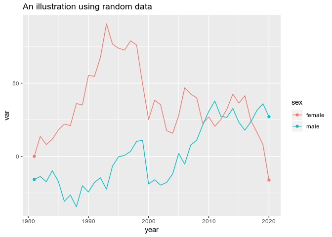

<!-- README.md is generated from README.Rmd. Please edit that file -->
nrsplot
=======

[](https://www.repostatus.org/#concept)

Use nrsplot to help you create ggplot2 charts in the style used by National Records of Scotland. nrsplot is inspired by the BBC Visual and Data Journalism team's [bbplot](https://medium.com/bbc-visual-and-data-journalism/how-the-bbc-visual-and-data-journalism-team-works-with-graphics-in-r-ed0b35693535). nrsplot can be used interactively or as part of a [reproducible analytical pipeline](https://ukgovdatascience.github.io/rap_companion/).

Installation
------------

Install nrsplot from GitHub with:

``` r
# install.packages("devtools")
devtools::install_github("DataScienceScotland/nrsplot")
```

If the above does not work, you can install from source:

1.  Go to the nrsplot [repository](https://github.com/DataScienceScotland/nrsplot) on GitHub
2.  Click **Clone or download** then **Download ZIP**
3.  Save the file locally (e.g. your H drive) and Unzip
4.  Install with install.packages()

``` r
install.packages("your/directory/nrsplot-master", repos = NULL,
                 type="source", lib = "your/R/package/library/directory")
```

Examples
--------

A normal line chart:

``` r
library(ggplot2)
library(nrsplot)
set.seed(42)

df <- data.frame(year = 1981:2020,
                 sex = c(rep("female", 40), rep("male", 40)),
                 dummy_variable = diffinv(rnorm(79)) * 10)

p <- ggplot(df, aes(year, dummy_variable, colour = sex)) +
  labs(title = "An illustration using random data")

p + geom_line()
```



Apply the NRS theme:

``` r
p +
  geom_line_nrs() + 
  nrs_theme() +
  scale_colour_manual(values = c(nrs_palette[["household"]][["main"]],
                                 nrs_palette[["neutral"]][["grey"]]))
```


